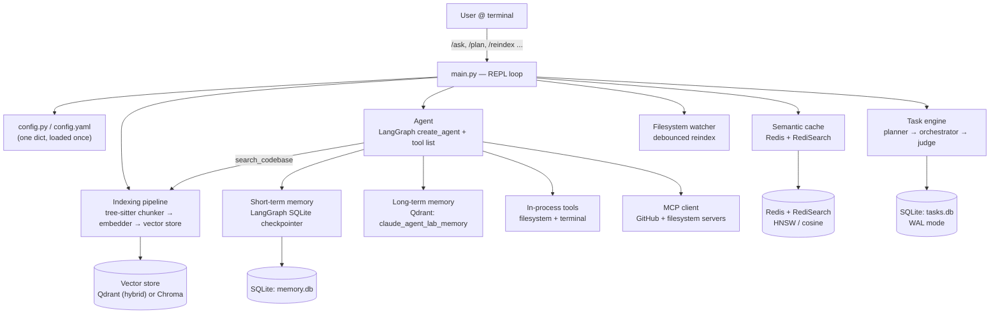
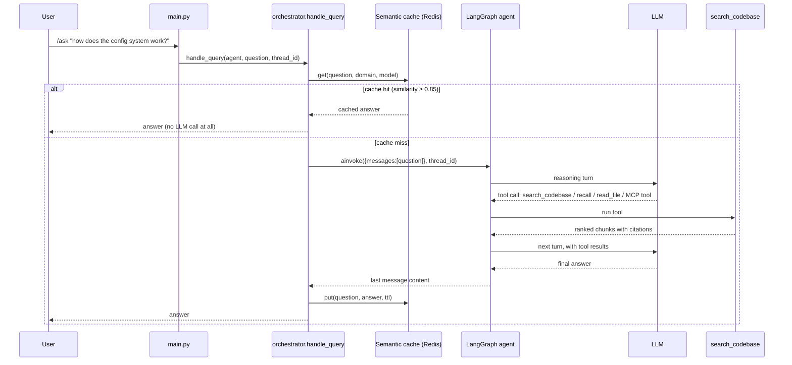
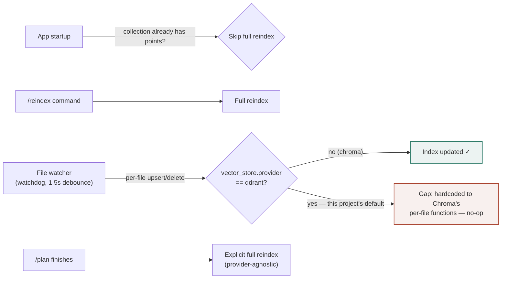

# claude_agent_lab

A RAG-powered, agentic CLI code assistant — built phase by phase as a system-design learning project.

Each phase's design decisions, tradeoffs, and real bugs found along the way are documented as they happen, not silently. See `docs/prd.md` for the phase breakdown and `docs/progress.md` for what was built, fixed, and why.

## Status

The core pipeline is built and verified against real infrastructure — indexing, retrieval, and the agent all tested against a live Qdrant instance and real MCP servers (not just "it imports"). The CLI (`main.py`) is the only interface.

What's here:
- **Config** (`config.py`, `config.yaml`) — plain YAML, loaded once at import time. `.env` for secrets.
- **LLM/embeddings** (`llm/factory.py`) — LangChain-based, provider chosen by `config.yaml`'s `llm.provider`, no code change needed to switch: `anthropic` (default), `openai`, `gemini`, `groq`, or `ollama` (local, no API key). `HuggingFaceEmbeddings` for embeddings by default (runs locally, no API key needed).
- **Indexing & retrieval** (`context/indexers/`, `context/retrievers/`) — tree-sitter-based code-aware chunking (15 languages), semantic (Chroma or Qdrant) or hybrid (Qdrant native sparse+dense) retrieval, chosen via `config.yaml`. Default: Qdrant + hybrid.
- **Agent** (`agent/`) — LangChain's `create_agent` + LangGraph checkpointer-backed memory, with a `search_codebase` tool, filesystem tools (`tools/filesystem_tools.py`), a terminal tool (`tools/terminal_tools.py`), MCP tools (GitHub + filesystem servers), and skill-as-tool loading.
- **Memory** (`memory/`) — session tracking (which conversation thread is "current") plus a SQLite-backed LangGraph checkpointer with automatic summarization once a conversation gets long. Plus **long-term memory** (`memory/long_term.py`) — cross-session facts/preferences in a separate Qdrant collection, retrieved and saved via `recall`/`remember` agent tools. See "Long-term memory" below.
- **MCP** (`mcp/`) — connects to the servers listed in `mcp_servers.json` (GitHub, filesystem, by default).
- **Tasks** (`tasks/`) — a `/plan <goal>` planner/executor with approval and recovery steps.
- **Cache** (`cache/`) — Redis-backed semantic cache for `/ask` answers; degrades to "disabled" instead of crashing if Redis isn't running.
- **Skills** (`skills/`) — a skill registry loaded as agent tools.
- File watcher (`context/indexers/watcher.py`) — re-invalidates the semantic cache when the codebase changes. **Known gap:** hardcoded to Chroma's per-file update functions regardless of `vector_store.provider` — with this project's Qdrant default, file changes don't actually reach the live index; only a full re-index (`/reindex`) does. Left as-is and documented rather than silently patched — see `docs/progress.md`.

**Out of scope:** a web dashboard. The CLI covers the same functionality and is the only supported interface. (History of what was tried: `docs/progress.md`.)

## System design walkthrough

`docs/system-design-interview-walkthrough.html` is a self-contained, interactive reference doc — open it directly in a browser — written as a script for explaining this project's design end to end: functional/non-functional requirements, a worked use case, RAG vs. grep (and how Claude Code/Cursor/Copilot are publicly described to differ), indexing & freshness, STM vs. LTM, caching, tools vs. MCP, skills, the `/plan` task engine, named agentic architecture patterns (ReAct, Orchestrator-Workers, Evaluator-Optimizer, HITL — and which ones this project deliberately does *not* use), LLD, and a deployment plan. Every diagram in it expands to fullscreen with zoom.

One diagram from it — the high-level architecture:



A second diagram — one `/ask`, end to end (the ReAct reasoning ↔ tool-call loop, with the semantic cache short-circuiting it on a hit):



A third — how the index actually stays fresh, and the one real gap in that story (marked in red):



## Getting Started

**Prerequisites:**
- Python ≥3.12
- A running Qdrant instance — `docker run -p 6333:6333 qdrant/qdrant` (or point `QDRANT_URL`/`QDRANT_API_KEY` at a remote one). The CLI does not run without this — indexing happens at startup.
- Node.js/`npx` — the MCP servers (GitHub, filesystem) launch via `npx`.
- Optional: Redis (`redis://localhost:6379`) for the semantic cache — the app runs fine without it, just without caching.

The first run downloads the local embedding model from Hugging Face Hub; after that it's
cached (`~/.cache/huggingface`). If you restart the app often during development and hit
`HTTP Error 429 ... Rate limited` on startup, set `HF_HUB_OFFLINE=1` to skip the network
metadata check and use the cached model directly.

```bash
# 1. Install dependencies (Poetry, or plain pip -e .)
poetry install

# 2. Configure credentials
cp .env.example .env
# edit .env and set ANTHROPIC_API_KEY (and GITHUB_TOKEN if you'll use the github MCP server)

# 3. Start Qdrant
docker run -p 6333:6333 qdrant/qdrant

# 4. Run the REPL
poetry run claude_agent_lab
```

On startup, the CLI indexes the current directory (skipping unchanged data on repeat runs), connects to configured MCP servers, and starts a session:

```
> /ask how does the config system work?
<answer, grounded in retrieved code, from the agent's search_codebase tool>

> /reindex               # re-index the current directory after changes
> /new_session           # start a fresh conversation
> /switch <session_id>   # resume a past session
> /plan <goal>           # generate and execute a multi-step plan
> /task_status           # show progress on active plans
```

### Switching LLM providers

`llm/factory.py` supports five providers — a `config.yaml` edit, no code change:

```yaml
llm:
  provider: anthropic   # anthropic | openai | gemini | groq | ollama
  model: claude-opus-5  # a model name valid for that provider
```

Each provider (except `ollama`, which talks to a local server instead) reads its API key
from its own env var — see `.env.example`. `anthropic` and `openai` were the original two
providers; `gemini`, `groq`, and `ollama` were added on top of the same factory pattern
(see `docs/progress.md`).

### Long-term memory

Separate from a session's own conversation history (`/new_session` wipes that, per-thread),
the agent can save durable facts/preferences that persist across every future session — a
coding-style preference, a project convention, a correction. Stored in their own Qdrant
collection (`long_term_memory.collection_name` in `config.yaml`, default
`claude_agent_lab_memory`), retrieved by semantic similarity, not exact match.

The agent decides when to use it — two tools, same pattern as `search_codebase`:
- **`remember(fact, category)`** — called when you state something durable ("I prefer early
  returns over nested if/else").
- **`recall(query)`** — called before answering, if a past preference might be relevant.

`memory/session.py` and `memory/short_term.py` handle per-session history;
`memory/long_term.py` is what adds cross-session recall (see `docs/progress.md` for
the design decisions and why this wasn't automatic-injection-on-every-turn instead).

## Bugs found and fixed during development

Real bugs found and fixed by actually running the system, not hypothetical:

1. **`tree-sitter-languages` is unmaintained** and has no wheels for current Python — swapped for `tree-sitter-language-pack`, the actively maintained fork with the same `get_language()`/`get_parser()` API.
2. **Byte-offset/character-offset bug in the code parser** — tree-sitter's `start_byte`/`end_byte` are UTF-8 *byte* offsets, but the code sliced the Python `str` (character-indexed) with them, silently corrupting every chunk's name and content as soon as a multi-byte character (em dash, arrow, smart quote — common throughout this codebase's own docstrings) appeared anywhere earlier in the file. Fixed by slicing the encoded bytes and decoding the result.
3. **`config.yaml` had a duplicate `vector_store:` key** (the second silently overwrote the first) — consolidated into one block.
4. **Missing `sentence-transformers` dependency** — required by `langchain_huggingface.HuggingFaceEmbeddings` at runtime but not declared in `pyproject.toml`.
5. **A blank `QDRANT_API_KEY=` in `.env` silently forces HTTPS against a local Qdrant, causing an `SSL: WRONG_VERSION_NUMBER` error** — `qdrant-client` treats "empty string" and "not provided" as different states (only `None` skips the HTTPS inference), and `os.getenv()` returns `""` for a blank env line, not `None`. Fixed at all four call sites (`context/{indexers,retrievers}/{semantic,hybrid}_qdrant.py`) with `os.getenv(...) or None`. Found by a user actually running the CLI per this README's own instructions — see `docs/progress.md` for how it was actually diagnosed.
6. **MCP tools reconnected — and for `stdio` servers, respawned their subprocess — on every single tool call**, not once per app run, because `MultiServerMCPClient.get_tools()` opens a new session per call by design. Fixed by opening one session per server and keeping it alive for the app's lifetime via an `AsyncExitStack`. Found by noticing `Secure MCP Filesystem Server running on stdio` printing repeatedly mid-conversation instead of once at startup — this was the actual cause of `/ask` feeling slow, not LLM latency.

See `docs/progress.md` for the full writeup, including what was *not* changed and why.

## Roadmap

| Phase | Focus | Status |
|---|---|---|
| 1 | Config system, LLM/embedder factory, CLI skeleton | Built, verified |
| 2 | Code indexing & retrieval (semantic + hybrid) | Built, verified against live Qdrant |
| 3 | Agent orchestration + tool execution | Built, verified (real MCP tools loaded) |
| 4 | Session & short-term memory | Built (LangGraph checkpointer) |
| 5 | MCP tool integration | Built, verified (GitHub + filesystem servers, 40 tools) |
| 6 | Agentic task planner | Built |
| 7 | Production concerns (cache, watcher, skills) | Built |
| 8 | Dashboard UI (FastAPI + React) | Removed — see `docs/progress.md` |

Full detail: `docs/prd.md`.

## Project Layout

```
claude_agent_lab/              ← repo
├── claude_agent_lab/           ← the package
│   ├── agent/                  ← LangChain/LangGraph agent factory + orchestrator
│   ├── cache/                  ← Redis-backed semantic cache
│   ├── context/
│   │   ├── indexers/           ← tree-sitter chunking, semantic/hybrid indexers, file watcher
│   │   └── retrievers/         ← semantic/hybrid retrieval
│   ├── llm/                    ← LangChain LLM/embedder factory
│   ├── mcp/                    ← MCP client + config
│   ├── memory/                 ← session tracking, LangGraph checkpointer, long-term memory
│   ├── observability/          ← logging
│   ├── skills/                 ← skill registry + skill-as-tool loading
│   ├── tasks/                  ← planner/executor/approval/recovery
│   ├── tools/                  ← filesystem + terminal tools
│   ├── config.py / config.yaml
│   ├── mcp_servers.json
│   └── main.py
├── docs/
│   ├── prd.md
│   ├── progress.md
│   └── system-design-interview-walkthrough.html   ← open in a browser
├── .env.example
├── CLAUDE.md
└── pyproject.toml
```
