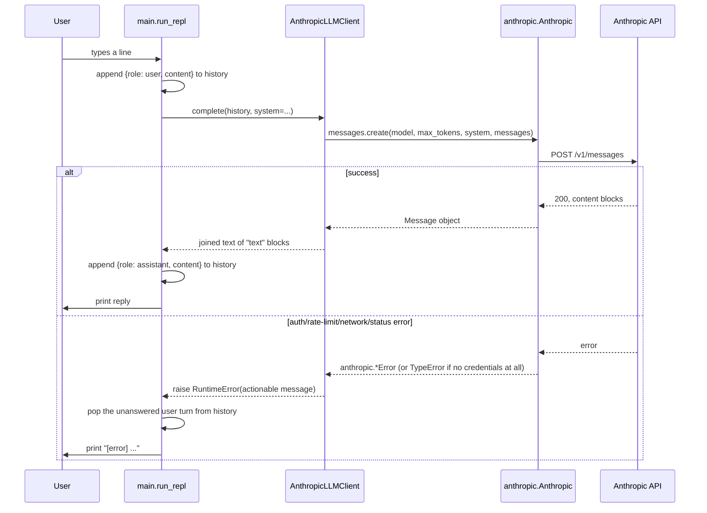

# Progress Log

One entry per phase/session. Each entry stays self-contained enough that a reader with zero context on this project can follow it without opening the diff.

---

## Phase 1 — Config system, LLM/embedder factory, logger, CLI skeleton

**Branch:** `phase-1-foundations` (off `main`)
**Date:** 2026-09-05

### In plain terms

This session built the "plumbing" the whole project stands on — nothing user-facing yet, just the pieces every later feature will plug into:

- **A settings file** (`config.yaml`) that says which AI model to use, plus a `.env` file (kept private, never uploaded to GitHub) that holds the actual API key. You can change the model or turn on more logging just by editing `config.yaml` — no code changes needed.
- **A "factory"** — one function you call to get an AI chat client, and one function to get a text-embedding client (embeddings turn text into a list of numbers so a computer can compare meanings later — that's for search, in Phase 2). Today this factory only knows how to build Anthropic's Claude client for chat, and a fake stand-in for embeddings so nothing costs money or needs a second API key yet.
- **A simple logger** — so the app can print timestamped status/error lines instead of nothing at all.
- **A chat loop (REPL)** — run the program, type a message, get Claude's reply back, type `/exit` to quit. That's it — no memory beyond the current run, no tools, no "agent" behavior yet. It exists purely to prove the settings file and the factory actually work together with a real API call.

Think of this phase as building a car's chassis and wiring harness before any of the actual driving features (RAG search, task planning, etc.) get bolted on in later phases.

### What changed

This is the first working slice of the project: everything downstream (RAG, agent orchestration, memory, MCP, task planning) will sit on top of the three pieces built here.

- **Config system** (`claude_agent_lab/config.py`, `config.yaml`, `.env.example`): a `Settings` model (Pydantic) built by merging, in explicit precedence order, environment variables → `.env` → `config.yaml` → built-in field defaults. `config.yaml` is versioned and holds only non-secret values (LLM provider/model/max_tokens, embedding provider/model, log level); API keys are read exclusively from the environment and never touch the yaml file.
- **LLM/embedder factory** (`claude_agent_lab/llm/`):
  - `base.py` — `LLMClient` and `Embedder` as structural `Protocol`s, not ABCs, so providers don't need to inherit from anything.
  - `anthropic_client.py` — `AnthropicLLMClient`, a thin wrapper over `anthropic.Anthropic().messages.create(...)` that collapses SDK-specific exceptions into a single `RuntimeError` with an actionable message.
  - `embedders.py` — `FakeEmbedder` (deterministic, hash-based, zero dependencies — the default) and `VoyageEmbedder` (real Voyage AI client, implemented but not yet exercised against a live account; wiring lands with retrieval in Phase 2).
  - `factory.py` — `get_llm_client(settings)` / `get_embedder(settings)`, the only place that switches on `provider` strings.
- **Minimal logger** (`claude_agent_lab/observability/logger.py`): `configure_logging()` (idempotent, stdlib `logging.basicConfig`) + `get_logger(name)` for namespaced child loggers.
- **CLI skeleton** (`claude_agent_lab/main.py`): a REPL loop — read a line, send it plus history to the configured `LLMClient`, print the reply, repeat until `/exit`. No RAG, no tools, no agent loop — this phase proves config → factory → a real API call works end to end.
- **Packaging**: `pyproject.toml` (Poetry, flat layout per `CLAUDE.md` — `claude_agent_lab/` package at repo root, no `src/`).
- **Docs**: this file, and `README.md`'s Status/Limitations/Roadmap sections.

### Architecture decisions

**1. How should config precedence work?**
- *In plain terms:* If a setting is defined in more than one place (the checked-in `config.yaml`, a private `.env` file, or an environment variable), which one wins? We picked a simple, memorable rule: environment variable beats `.env` file beats `config.yaml` beats the code's built-in default. Secrets (API keys) are never allowed in `config.yaml` at all, since that file gets pushed to GitHub.
- *Problem:* Need non-secret settings versioned in git (so `git blame` shows who changed a default and why) while secrets never touch a tracked file, and while still letting a developer override anything locally without editing the checked-in file.
- *Options considered:*
  a. `pydantic-settings`' `BaseSettings` with a custom YAML settings source, relying on its built-in source-precedence/merge behavior.
  b. Plain Pydantic `BaseModel`s plus a small hand-written merge function that reads `config.yaml`, overlays `AGENT_LAB_*` env vars, then reads secrets straight from `os.environ`.
  c. A single flat `.env` file for everything, no yaml.
- *What was chosen:* (b) — explicit, hand-written merge.
- *Tradeoff:* Loses `pydantic-settings`' automatic nested-env-var merging and its dotenv integration niceties, and duplicates a little of what that library provides. In exchange, precedence is fully readable from `_apply_env_overrides` — no need to know the library's internal source-ordering rules to answer "where did this value come from," which matters for a project whose stated goal (`docs/prd.md`) is understanding each layer, not just using it. (c) was rejected because secrets and non-secret defaults have different git-tracking requirements and shouldn't share a file.

**2. Where do embeddings come from, given Anthropic doesn't serve them?**
- *In plain terms:* Anthropic (the company behind Claude) doesn't offer its own text-embedding service, so we need a second provider for that later. Rather than force everyone to sign up for a second API just to run this early skeleton, the default is a "fake" embedder that makes up numbers locally — good enough to prove the plumbing works, useless for real search. The real provider (Voyage AI) is written and ready, just switched off by default until Phase 2 actually needs it.
- *Problem:* Phase 1 needs a working `Embedder` factory, but Anthropic has no first-party embeddings endpoint, and nothing in Phase 1 actually calls an embedder yet.
- *Options considered:*
  a. Skip the embedder factory entirely until Phase 2 needs it.
  b. Default straight to a real provider (Voyage AI — Anthropic's recommended embeddings partner) and require an API key just to run the CLI.
  c. Implement a real provider (Voyage) for when it's needed, but default to a dependency-free deterministic stub so the CLI has zero setup cost in Phase 1.
- *What was chosen:* (c).
- *Tradeoff:* `FakeEmbedder` produces vectors with no semantic meaning — it must never be used past local dev/tests, and that constraint is easy to forget once retrieval code exists in Phase 2. Documented directly in the class docstring and `config.yaml` comments to keep the footgun visible. In exchange, `poetry install && poetry run claude-agent-lab` works with only an Anthropic key, not two provider keys.
- *Open item:* `VoyageEmbedder` is written against the documented `voyageai` client shape but has not been run against a live Voyage account. Flagging here rather than fabricating a "verified" claim — first real exercise happens when Phase 2 wires retrieval to it.

**3. Protocols vs. ABCs for `LLMClient`/`Embedder`?**
- *In plain terms:* We wanted a clear "shape" that any AI provider's client must match (a `.complete(...)` method for chat, an `.embed(...)` method for embeddings), so the rest of the app doesn't care which provider it's talking to. Python offers two ways to define that shape; we picked the more relaxed one (`Protocol`) over the stricter one (`ABC`) — see the tradeoff below.
- *Problem:* Need an interface the factory can return and later phases (agent orchestrator, retrievers) can depend on, without hard-coupling every provider implementation to a base class.
- *Options considered:* `abc.ABC` with `@abstractmethod`, vs. `typing.Protocol` (structural typing).
- *What was chosen:* `Protocol`.
- *Tradeoff:* Structural typing means a class satisfies the interface just by having the right method signatures — nothing stops someone from writing a class that accidentally matches `LLMClient` without meaning to implement it. Accepted because it keeps provider modules free of any import-time dependency on the interface module, which matters once MCP-based and other external tool providers get added later.

### HLD — how this phase's concern would be designed from a blank page

The two things worth designing carefully in Phase 1 are (a) how a runtime value gets resolved from several possible sources, and (b) what happens on one REPL turn.

**Config resolution (decision logic):**

**One REPL turn (request flow):**

### LLD — classes/functions/data flow introduced this phase

| Module | Symbol | Responsibility |
|---|---|---|
| `config.py` | `LLMConfig`, `EmbeddingConfig`, `Settings` (Pydantic `BaseModel`s) | Typed shape of resolved config |
| `config.py` | `_load_yaml(path) -> dict` | Read `config.yaml`; `{}` if absent; error if not a mapping |
| `config.py` | `_apply_env_overrides(config) -> dict` | Overlay `AGENT_LAB_<SECTION>_<FIELD>` env vars onto the config dict per `_ENV_OVERRIDES` |
| `config.py` | `get_settings(config_path=None, env_path=None) -> Settings` | `@lru_cache`d entry point: loads `.env`, merges yaml + env + secrets, returns a validated `Settings` |
| `llm/base.py` | `ChatMessage` (`TypedDict`) | `{role: str, content: str}` — the message shape every `LLMClient` speaks |
| `llm/base.py` | `LLMClient`, `Embedder` (`Protocol`s) | `complete(messages, *, system=None) -> str`; `embed(texts) -> list[list[float]]` |
| `llm/anthropic_client.py` | `AnthropicLLMClient` | Wraps `anthropic.Anthropic`; maps SDK exceptions (`AuthenticationError`, `PermissionDeniedError`, `NotFoundError`, `RateLimitError`, `APIConnectionError`, `APIStatusError`, and the no-credentials `TypeError`) to `RuntimeError` |
| `llm/embedders.py` | `FakeEmbedder` | SHA-256-hash-based deterministic vectors; dev/test default |
| `llm/embedders.py` | `VoyageEmbedder` | Lazily imports `voyageai`; wraps `Client.embed(texts, model=..., input_type="document")` |
| `llm/factory.py` | `get_llm_client(settings) -> LLMClient`, `get_embedder(settings) -> Embedder` | Provider-string switch; single place new providers get registered |
| `observability/logger.py` | `configure_logging(level="INFO")`, `get_logger(name)` | Idempotent root setup + namespaced child loggers |
| `main.py` | `run_repl()`, `main()` | Load settings → configure logging → build client → loop: read input, call `complete`, print reply or error, maintain `history: list[ChatMessage]` |

**Data flow:** `config.yaml` + `.env` + environment → `get_settings()` → `Settings` → `get_llm_client(settings)` → `AnthropicLLMClient` → `main.run_repl()` loop, with `ChatMessage` history flowing between the REPL and the client on every turn.

### Interview questions

Question-only — meant as prompts to answer out loud or in writing, not a Q&A key.

**Config & settings**
1. Why is the config merged by hand in this code instead of just using `pydantic-settings`' built-in merging?
2. If the same setting is in both `config.yaml` and an `AGENT_LAB_*` env var, which one wins — and where in the code decides that?
3. Why does `get_settings()` cache its result with `@lru_cache`? What could go wrong in tests if you forgot to clear that cache?
4. Why is `config.yaml` never allowed to hold API keys? Where do those come from instead?
5. What happens if you delete `config.yaml` entirely — does the app still start?
6. What happens if someone writes a YAML list at the top of `config.yaml` instead of key-value pairs?
7. Why must `.env` get loaded before the `AGENT_LAB_*` env var overrides are read?
8. If you wanted to add a new setting (say `llm.temperature`), what three places in the code would you need to touch?
9. Why does the env-override function change the same dictionary in place instead of building a new one?
10. Env vars are always strings. How does an env var like `"16000"` end up as the integer `16000` on the `Settings` object?
11. Why are API keys allowed to be empty/missing on the `Settings` object instead of the app crashing immediately if they're not set?
12. How would you support separate dev/staging/prod configs without changing this design?

**LLM/Embedder factory & protocols**
13. What's the real difference between `typing.Protocol` and `abc.ABC`, and why did this project pick `Protocol`?
14. Would `isinstance(client, LLMClient)` work as written? What would need to change for it to?
15. Why does the factory take the whole `Settings` object instead of separate arguments like `model` and `max_tokens`?
16. What's the one job of `factory.py`, and why isn't that logic mixed into the provider files themselves?
17. If you added a second LLM provider (say OpenAI), which files would you touch, and which would you never need to open?
18. Why does the Anthropic client only pass an API key explicitly when one is given, instead of always passing it?
19. If `ANTHROPIC_API_KEY` isn't set but the machine is logged in via `ant auth login`, does the Anthropic client still work?
20. When there are no credentials at all, the SDK doesn't raise a normal Anthropic error — it raises a plain `TypeError`. How does this project catch that so it doesn't crash the app?
21. Why does the code catch six different Anthropic error types separately instead of one broad "something went wrong" catch?
22. The SDK already retries failed requests automatically. Which of those six error types would you basically never see in practice, because the SDK gave up before your code ever ran?
23. Claude's response can contain more than one type of content block. Why does the code only join the "text" ones instead of grabbing the first block?
24. `FakeEmbedder` returns numbers, but not meaningful ones. What would actually break if a real search feature used it by mistake?
25. Why is the `voyageai` library imported inside the class instead of at the top of the file?
26. `VoyageEmbedder` tells the API it's embedding a "document." What would you pass instead when embedding a user's search query, and why does mixing the two hurt search quality?
27. This project admits `VoyageEmbedder` has never been tested against a real account. Why write it now instead of waiting, and what's the risk of leaving it untested?

**CLI / REPL skeleton**
28. If the AI call fails, the code removes the user's last message from history before continuing. Why?
29. What would go wrong with the conversation after a few failed messages if that removal step didn't happen?
30. Why does the conversation history live inside the `run_repl()` function instead of as a global variable?
31. What happens to the conversation history the moment you close the app? Which future phase is meant to fix that?
32. Building the AI client can fail in almost any way, so the code catches a broad `Exception` there — but only a specific `RuntimeError` around the actual chat call. Why the difference?
33. Why are "user pressed Ctrl+C" and "user closed the input stream" handled by the same piece of code?
34. Every chat turn resends the entire conversation so far to the API. Why, and what does that mean for cost as a conversation gets longer?
35. Why is the system prompt hardcoded in the code instead of being a setting in `config.yaml`?

**Observability**
36. Why is `configure_logging()` written so that calling it twice does nothing the second time?
37. What would go wrong if two different parts of the app each set up logging separately, with different formats, and neither checked whether logging was already set up?
38. Why do all the app's loggers get names like `claude_agent_lab.main` instead of just `main`?
39. What's deliberately missing from this logger compared to a production-grade setup, and why is that okay for now?

**Packaging & project structure**
40. Why does `pyproject.toml` explicitly list which folder is the package instead of letting Poetry guess?
41. What would have to change about how imports work if this project used a `src/` folder instead of putting the package at the repo root?
42. Why is the `anthropic` library pinned to "1.x, but not 2.x yet" instead of just "any version"?
43. What's the difference between running `claude-agent-lab` (the installed command) and running `python -m claude_agent_lab.main` directly?
44. `voyageai` is a required dependency even though the app doesn't use it by default. Is that a problem, and why or why not?

**Design tradeoffs / whole system**
45. If a future phase needs streaming replies instead of one full response at a time, what would have to change in the `LLMClient` interface, and would `main.py` need to change too?
46. Point to one spot in this phase where the "just use the library's default" shortcut was deliberately avoided in favor of writing it out by hand. Why was that worth the extra work?
47. If you added a second AI provider tomorrow, how many files would actually need to change, and why so few?
