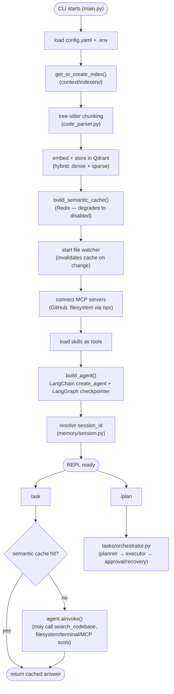

# Progress Log

One entry per session. Each entry stays self-contained enough that a reader with zero context on this project can follow it without opening the diff.

---

## Full backend port from source reference (Phases 1–7)

**Branch:** `dev` (fresh history — see below)
**Date:** 2026-09-07

### In plain terms

Earlier work on this repo (visible in its prior git history, before this branch) tried to rebuild this system from scratch, independently, using only the PRD's phase descriptions as a guide — not by looking at the actual reference codebase. That was a real miscommunication: the intent was always to **port** the reference implementation, phase by phase, adapting and fixing it as needed — not to invent a fresh design that happens to have similarly-named files.

This session corrects that. It copies the entire reference codebase (`source/capstone_project/educosys_claude/`) into this repo in one pass, renames everything per `CLAUDE.md`'s mapping table, and then does the real work: finding and fixing what's actually broken, verified by actually running it — against a live Qdrant database, real MCP servers, a real embedding model — not just checking that the code imports without error.

Because this is a bulk port rather than incremental phase-by-phase construction, this is one consolidated entry covering Phases 1–7 together, rather than seven separate entries re-narrating decisions that were already made by the original author. What follows is what was found, what was fixed, and what was deliberately changed versus left alone — that's the actual engineering content of a port, more so than describing code someone else already designed.

### What changed

- **Every source file copied in and renamed** per `CLAUDE.md`'s mapping: `educosys_claude` → `claude_agent_lab` throughout every import; `educosys_mcp_client.py` → `mcp_client.py`; `educosys_mcp_config.py` → `mcp_config.py`; `get_educosys_mcp_tools()` → `get_agent_mcp_tools()`; `load_educosys_mcp_configs()` → `load_mcp_configs()`; `educosys_mcp_servers.json` → `mcp_servers.json`; `.educosys/` → `.agent_lab/`; the Qdrant collection name; the CLI's own banner text; `pyproject.toml`'s package name and author.
- **`pyproject.toml`** — ported dependency list, with two real fixes (see below): `tree-sitter-languages` swapped for `tree-sitter-language-pack`, `sentence-transformers` added (was missing but required at runtime).
- **`config.yaml`** — `llm.provider`/`model` changed from `openai`/`gpt-5.5` to `anthropic`/`claude-opus-5`; `embeddings.provider` changed from `openai` to `huggingface` (local, no API key) with `dims` corrected from `1536` (OpenAI's dimension) to `384` (the actual dimension of the chosen local model — this one wasn't a preference, the old value was simply wrong for the new model and would have broken the semantic cache's Redis vector schema); the duplicate `vector_store:` key bug fixed (see below); `vector_store.provider`/`rag.mode` set to `qdrant`/`hybrid` to exercise the more complete, actually-hybrid retrieval path.
- **`context/indexers/code_parser.py`** — fixed the byte-offset/character-offset bug (see below); swapped the `tree_sitter_languages` import for `tree_sitter_language_pack`.
- **`.env.example`, `.gitignore`** — written fresh, reflecting the environment variables the ported code actually reads (`grep`'d for, not guessed) and the local data paths `config.yaml` actually uses.
- **`README.md`, `docs/prd.md`** — rewritten to describe the ported system accurately, including prerequisites (Qdrant, Node/`npx`, optionally Redis) the source code has always required.

### Real bugs found and fixed

These were found by actually running the code, not by reading it carefully enough to spot them in advance — worth being honest about that distinction.

**1. `tree-sitter-languages` is unmaintained and doesn't install on current Python**
- *In plain terms:* The exact library version the source pinned for parsing code (`tree-sitter-languages==1.10.2`) simply refuses to install on Python 3.13 — no compatible wheel exists. The install failed before any code even ran.
- *Fix:* Swapped for `tree-sitter-language-pack`, an actively maintained fork with the identical `get_language()`/`get_parser()` function signatures — confirmed as a true drop-in by testing both against the same Python source and comparing output before committing to the swap.

**2. Byte-offset vs. character-offset bug in the code parser — a real, silent correctness bug**
- *In plain terms:* Every chunk of code this system indexes — its name *and* its actual content — was being sliced out of the source file using the wrong kind of position number whenever the file contained certain punctuation, like an em dash or a smart quote, anywhere earlier in the file. The result wasn't a crash; it was silently wrong data going into the search index.
- *Problem:* `tree-sitter` reports a parsed node's position as `start_byte`/`end_byte` — offsets into the file's *UTF-8-encoded bytes*. The code was slicing the Python `str` (which is indexed by *character*, not byte) using those byte offsets directly: `source[node.start_byte:node.end_byte]`. A pure-ASCII file has one byte per character, so this happens to work — but any multi-byte character earlier in the file (an em dash is 3 bytes in UTF-8, one character) throws every subsequent offset out of alignment with the string's real character positions.
- *How it was found:* Running the real indexer against this project's own files (whose docstrings and comments use em dashes constantly, this being written largely by an assistant with that habit) produced obviously-wrong chunk names in the logs — fragments like `'le(filepat'` and `'ndler(FileSystemEvent'` instead of real function/class names. That's what sent the investigation to `_extract_name` and `_walk`.
- *Fix:* Encode the source to bytes once, pass the *bytes* through the recursive walk instead of the *string*, slice the bytes, and decode only the final extracted piece back to a string. Verified against a minimal repro (a comment containing an em dash before a function definition) and then against the real codebase, confirming clean names post-fix.
- *Why this matters more than it might look:* This bug doesn't just mislabel things in a debug log — the *content* field (`source_bytes[...].decode()`) is what actually gets embedded and stored for retrieval. A silently-corrupted chunk is a chunk that can never be found by a correct query, and nothing about the pipeline would have surfaced that as an error. It would have just made search quietly worse in any file with the punctuation this codebase's own comments use throughout.

**3. `config.yaml`'s duplicate `vector_store:` key**
- *In plain terms:* The config file defined the same setting twice. In YAML, when a key repeats, the *last* one silently wins — so whatever the first `vector_store:` block was trying to say was already being ignored before this port even started. Looked like an in-progress migration from Chroma to Qdrant that was never finished or cleaned up.
- *Fix:* Consolidated to one `vector_store:` block.

**4. Missing `sentence-transformers` dependency**
- *In plain terms:* Switching the embeddings provider to `huggingface` (see the provider-defaults decision below) meant a library (`sentence-transformers`) that the source project's `pyproject.toml` never needed to declare, because it never used that provider by default. Running the embedder without it fails with a clear `ModuleNotFoundError` — an easy one to catch, and worth listing here anyway since "which dependency does a config choice actually pull in" is exactly the kind of thing that's easy to get wrong when changing a default.
- *Fix:* Added `sentence-transformers` to `pyproject.toml`.

### Deliberate changes (not bugs — decisions, and why)

**Provider defaults: Anthropic for chat, local HuggingFace for embeddings**
- The source defaults to OpenAI for both. This fork is named `claude_agent_lab` and every other piece of this project assumes Claude — defaulting the actual LLM call to a different provider than the project's own name would be a strange thing to leave unchanged. `llm/factory.py` already had an `anthropic` branch; this is a config value change, not new code.
- Embeddings: Anthropic has no first-party embeddings API (true in the source project too, which is why it never offered an "anthropic" embeddings branch). Defaulting to a local HuggingFace model instead of OpenAI's means running this fork needs exactly one API key (`ANTHROPIC_API_KEY`), not two, for no functional reason. `llm/factory.py` already had a `huggingface` branch too — again, a config default change.

**`rag.mode: hybrid` / `vector_store.provider: qdrant` as the default, not semantic/chroma**
- The source's checked-in `config.yaml` actually defaulted to Chroma + semantic-only (the duplicate-key bug notwithstanding — both copies said `chroma`). But `CLAUDE.md`'s own renaming table already assumes Qdrant (`Qdrant collection educosys_claude → claude_agent_lab`) — meaning the project's own naming decisions were written with Qdrant as the intended target, even though the checked-in default pointed elsewhere. Defaulted to the more complete, more interesting implementation (`context/indexers/hybrid_qdrant.py`, which does real dense+sparse hybrid search via Qdrant's native support) rather than the plainer Chroma path, which still exists and still works if selected via config.

### Verification performed

Not claimed lightly — each of these was actually run, this session, against real infrastructure:

- **Indexing**: `get_indexer()('claude_agent_lab/llm')` against a live local Qdrant (`docker run -p 6333:6333 qdrant/qdrant`) — real HuggingFace embeddings computed, real FastEmbed sparse (BM25-style) vectors computed, chunks actually stored.
- **Retrieval**: querying that index for `"how do we get the embedder"` correctly returned the `get_embedder` function as the top hybrid-search result (score 1.0) — not just "returns something," the *right* something.
- **Agent construction**: `build_agent(checkpointer)` with a `langgraph.checkpoint.memory.InMemorySaver` — compiled successfully to a `CompiledStateGraph`, connected to **real** MCP servers (`npx`-launched GitHub and filesystem servers), loaded 40 real tools from them, and initialized the skills registry (gracefully, with a warning, when no skills directory exists yet).
- **Full CLI boot**: `python -m claude_agent_lab.main` end to end — indexed 99 real chunks from this project's own codebase, correctly detected Redis wasn't running and disabled the semantic cache instead of crashing, started the file watcher, connected MCP servers, started a session, printed the ready banner, accepted `/exit`, and shut down cleanly (including stopping the watcher).
- **Every one of the 32 ported modules** imports cleanly with no errors.

Not yet verified: a real end-to-end `/ask` or `/plan` call against the live Anthropic API (no API key was available in the sandbox this session ran in) — everything up to and including the actual model call was exercised; the model call itself wasn't.

### Open items

- No automated test suite exists yet — the source project didn't have one, and this session prioritized breadth (get the whole thing running, verified manually against real infra) over adding tests for someone else's ported code. Worth adding, not done here.
- A real `/ask`/`/plan` call against a live Anthropic API key hasn't been exercised — everything up to that call has been.
- The `tasks/`, `skills/`, and `cache/` modules were verified to *import* cleanly but not exercised end-to-end the way indexing/retrieval/agent-construction were — lower risk (they're smaller, more isolated, and `cache/` already has its own graceful-degradation path proven by the full-CLI-boot test), but flagged rather than silently assumed equally solid.

### HLD — the ported system, end to end

### LLD — module map (what lives where, and what phase it maps to)

| Directory | Phase | Key files |
|---|---|---|
| `config.py`, `config.yaml` | 1 | Plain YAML config loaded once at import time into a module-level `config` dict |
| `llm/` | 1 | `factory.py`: `get_llm()`/`get_embedder()`, provider-branching on config |
| `observability/` | 1 | `logger.py`: root logger at WARNING (suppresses third-party noise), app loggers at DEBUG |
| `context/indexers/` | 2 | `code_parser.py` (tree-sitter chunking, 15 languages + text fallback), `factory.py` (mode/provider dispatch), `semantic_qdrant.py`/`hybrid_qdrant.py`/`semantic_chroma.py`, `watcher.py` |
| `context/retrievers/` | 2 | Mirrors the indexers: `factory.py` + one `retrieve()` per backend |
| `agent/` | 3 | `factory.py` (`build_agent`, LangChain `create_agent`), `orchestrator.py` (`handle_query`, semantic-cache-aware), `tools.py` (`search_codebase`) |
| `tools/` | 3 | `filesystem_tools.py` (read/write/append/list/exists), `terminal_tools.py` (`run_command`, `run_in_directory`, denylist + timeout) |
| `memory/` | 4 | `session.py` (current-session file), `short_term.py` (LangGraph SQLite checkpointer + summarization middleware) |
| `mcp/` | 5 | `mcp_client.py` (`get_agent_mcp_tools`), `mcp_config.py` (`load_mcp_configs`, `${VAR}` resolution) |
| `tasks/` | 6 | `planner.py`, `executor.py`, `approval.py`, `recovery.py`, `status.py`, `task_store.py`, `orchestrator.py` |
| `cache/` | 7 | `semantic_cache.py`: Redis + `redisvl`, graceful degradation on connection failure |
| `skills/` | 7 | `registry.py`, `skill_tools.py`: skills loaded as agent tools |

### Interview questions

Question-only — meant as prompts to answer out loud or in writing, not a Q&A key.

**The byte-offset bug**
1. Why does `tree_sitter`'s `start_byte`/`end_byte` not match a Python `str`'s character indices in general?
2. Why did this bug only show up on files containing certain characters, and stay invisible on plain-ASCII files?
3. Besides an em dash, name two other common characters that would trigger the same corruption.
4. Why does the fix pass `bytes` through the whole recursive walk instead of encoding at the point of each slice?
5. Why is this bug worse than a crash would have been?
6. How would you write a regression test that catches this specific class of bug in the future?

**Dependency rot / the tree-sitter swap**
7. What does "no compatible wheel" actually mean, mechanically, when a `pip install` fails?
8. Why was it important to verify `tree-sitter-language-pack` produces identical output to `tree-sitter-languages` before committing to the swap, rather than just checking that it imports?
9. What's the risk of pinning a dependency to an exact version (`==1.10.2`) versus a range, in a project like this one?

**Config bugs**
10. In YAML, what actually happens when a mapping key is repeated? Why doesn't it raise an error?
11. How would you catch a duplicate-key config bug automatically, before it ships?
12. Why did the wrong `dims: 1536` value not cause an immediate error, only a downstream one (in the semantic cache's vector schema)?

**Provider defaults**
13. Why does Anthropic have no embeddings offering, and what do teams building on Claude typically do instead?
14. What's the tradeoff between a local embedding model (HuggingFace, runs on your machine) and an API-based one (OpenAI, Voyage) — cost, latency, quality, setup?
15. If you switched `embeddings.provider` after already indexing a codebase, what would break, and why?

**Agent architecture (LangChain/LangGraph)**
16. What does `langchain.agents.create_agent(llm, tools=..., checkpointer=...)` actually build, at a high level?
17. What is a `thread_id` for, in `agent.ainvoke({"messages": [...]}, {"configurable": {"thread_id": ...}})`?
18. Why does `search_codebase` exist as a *tool* the agent can choose to call, rather than the CLI always retrieving context before every question?
19. What's the difference between the checkpointer (`memory/short_term.py`) and the session file (`memory/session.py`) — what does each one actually track?
20. Why does `SummarizationMiddleware` trigger on a token count, not a message count?

**MCP**
21. What does `get_agent_mcp_tools()` actually do when the CLI starts — trace the call from `mcp_config.py` through to tools being available to the agent.
22. Why is `${CWD}` resolved at load time instead of being hardcoded into `mcp_servers.json`?
23. What would happen if the `npx`-launched MCP server process failed to start — does anything in this codebase handle that gracefully?

**Retrieval**
24. What's the actual difference between `rag.mode: semantic` and `rag.mode: hybrid` in this codebase — what gets stored differently in Qdrant?
25. What is `FastEmbedSparse(model_name="Qdrant/bm25")` actually computing, conceptually?
26. Why does `index_codebase` check for an existing non-empty collection before re-indexing, and what real problem does that avoid?
27. What real limitation does chunking at "the first named block found, don't descend further" (`_walk`'s early `return`) have for a large class with many methods?

**Graceful degradation**
28. Why does `build_semantic_cache()` catch a broad `Exception` and return `None` instead of letting a Redis connection failure crash the app?
29. What's the tradeoff of catching exceptions that broadly, versus catching specific ones (`redis.ConnectionError`, say)?
30. Where else in this codebase does a similar "degrade instead of crash" pattern show up?

**The porting process itself**
31. What's the actual difference between "port the source, fix what's broken" and "write an independent implementation guided by the same file names"? Why does that difference matter for what gets learned?
32. Why does verifying against real infrastructure (a live Qdrant, real MCP servers) catch bugs that "the code imports without error" cannot?
33. What's the risk of silently fixing a bug found during a port without documenting it, versus writing it up the way this entry does?
34. Which of this session's four fixes were forced (the code literally wouldn't run without them) versus discretionary (the code would run, just wrongly or suboptimally)?
35. Why does Phase 8 get built independently while Phases 1-7 were ported — what's the actual distinguishing criterion?
