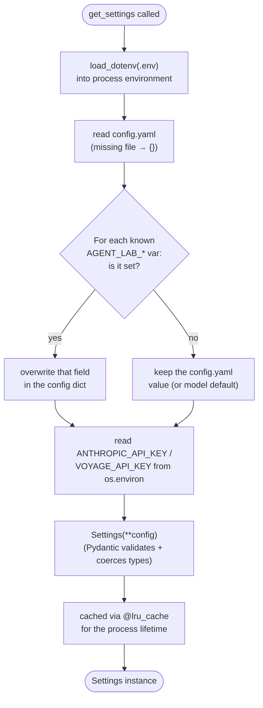
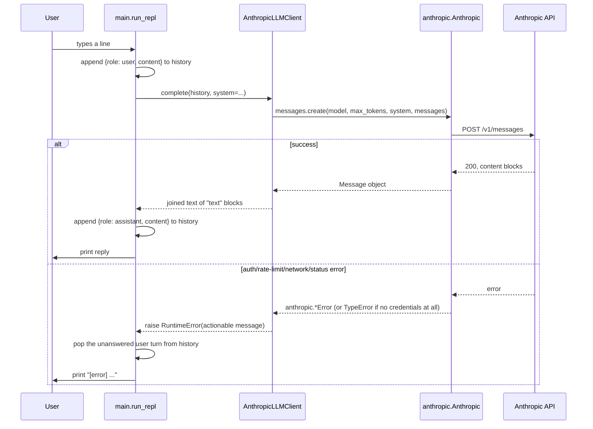

# Progress Log

One entry per phase/session. Each entry stays self-contained enough that a reader with zero context on this project can follow it without opening the diff.

---

## Phase 1, Day 1 — Config system, LLM/embedder factory, logger, CLI skeleton

**Branch:** `phase-1-foundations` (off `main`)
**Date:** 2026-09-05

### What changed

This is the first working slice of the project: everything downstream (RAG, agent orchestration, memory, MCP, task planning) will sit on top of the three pieces built here.

- **Config system** (`claude_agent_lab/config.py`, `config.yaml`, `.env.example`): a `Settings` model (Pydantic) built by merging, in explicit precedence order, environment variables → `.env` → `config.yaml` → built-in field defaults. `config.yaml` is versioned and holds only non-secret values (LLM provider/model/max_tokens, embedding provider/model, log level); API keys are read exclusively from the environment and never touch the yaml file.
- **LLM/embedder factory** (`claude_agent_lab/llm/`):
  - `base.py` — `LLMClient` and `Embedder` as structural `Protocol`s, not ABCs, so providers don't need to inherit from anything.
  - `anthropic_client.py` — `AnthropicLLMClient`, a thin wrapper over `anthropic.Anthropic().messages.create(...)` that collapses SDK-specific exceptions into a single `RuntimeError` with an actionable message.
  - `embedders.py` — `FakeEmbedder` (deterministic, hash-based, zero dependencies — the default) and `VoyageEmbedder` (real Voyage AI client, implemented but not yet exercised against a live account; wiring lands with retrieval in Phase 2).
  - `factory.py` — `get_llm_client(settings)` / `get_embedder(settings)`, the only place that switches on `provider` strings.
- **Minimal logger** (`claude_agent_lab/observability/logger.py`): `configure_logging()` (idempotent, stdlib `logging.basicConfig`) + `get_logger(name)` for namespaced child loggers.
- **CLI skeleton** (`claude_agent_lab/main.py`): a REPL loop — read a line, send it plus history to the configured `LLMClient`, print the reply, repeat until `/exit`. No RAG, no tools, no agent loop — this phase proves config → factory → a real API call works end to end.
- **Packaging**: `pyproject.toml` (Poetry, flat layout per `CLAUDE.md` — `claude_agent_lab/` package at repo root, no `src/`).
- **Docs**: this file, and `README.md`'s Status/Limitations/Roadmap sections.

### Architecture decisions

**1. How should config precedence work?**
- *Problem:* Need non-secret settings versioned in git (so `git blame` shows who changed a default and why) while secrets never touch a tracked file, and while still letting a developer override anything locally without editing the checked-in file.
- *Options considered:*
  a. `pydantic-settings`' `BaseSettings` with a custom YAML settings source, relying on its built-in source-precedence/merge behavior.
  b. Plain Pydantic `BaseModel`s plus a small hand-written merge function that reads `config.yaml`, overlays `AGENT_LAB_*` env vars, then reads secrets straight from `os.environ`.
  c. A single flat `.env` file for everything, no yaml.
- *What was chosen:* (b) — explicit, hand-written merge.
- *Tradeoff:* Loses `pydantic-settings`' automatic nested-env-var merging and its dotenv integration niceties, and duplicates a little of what that library provides. In exchange, precedence is fully readable from `_apply_env_overrides` — no need to know the library's internal source-ordering rules to answer "where did this value come from," which matters for a project whose stated goal (`docs/prd.md`) is understanding each layer, not just using it. (c) was rejected because secrets and non-secret defaults have different git-tracking requirements and shouldn't share a file.

**2. Where do embeddings come from, given Anthropic doesn't serve them?**
- *Problem:* Phase 1 needs a working `Embedder` factory, but Anthropic has no first-party embeddings endpoint, and nothing in Phase 1 actually calls an embedder yet.
- *Options considered:*
  a. Skip the embedder factory entirely until Phase 2 needs it.
  b. Default straight to a real provider (Voyage AI — Anthropic's recommended embeddings partner) and require an API key just to run the CLI.
  c. Implement a real provider (Voyage) for when it's needed, but default to a dependency-free deterministic stub so the CLI has zero setup cost in Phase 1.
- *What was chosen:* (c).
- *Tradeoff:* `FakeEmbedder` produces vectors with no semantic meaning — it must never be used past local dev/tests, and that constraint is easy to forget once retrieval code exists in Phase 2. Documented directly in the class docstring and `config.yaml` comments to keep the footgun visible. In exchange, `poetry install && poetry run claude-agent-lab` works with only an Anthropic key, not two provider keys.
- *Open item:* `VoyageEmbedder` is written against the documented `voyageai` client shape but has not been run against a live Voyage account. Flagging here rather than fabricating a "verified" claim — first real exercise happens when Phase 2 wires retrieval to it.

**3. Protocols vs. ABCs for `LLMClient`/`Embedder`?**
- *Problem:* Need an interface the factory can return and later phases (agent orchestrator, retrievers) can depend on, without hard-coupling every provider implementation to a base class.
- *Options considered:* `abc.ABC` with `@abstractmethod`, vs. `typing.Protocol` (structural typing).
- *What was chosen:* `Protocol`.
- *Tradeoff:* Structural typing means a class satisfies the interface just by having the right method signatures — nothing stops someone from writing a class that accidentally matches `LLMClient` without meaning to implement it. Accepted because it keeps provider modules free of any import-time dependency on the interface module, which matters once MCP-based and other external tool providers get added later.

### HLD — how this phase's concern would be designed from a blank page

The two things worth designing carefully in Phase 1 are (a) how a runtime value gets resolved from several possible sources, and (b) what happens on one REPL turn.

**Config resolution (decision logic):**

**One REPL turn (request flow):**

### LLD — classes/functions/data flow introduced this phase

| Module | Symbol | Responsibility |
|---|---|---|
| `config.py` | `LLMConfig`, `EmbeddingConfig`, `Settings` (Pydantic `BaseModel`s) | Typed shape of resolved config |
| `config.py` | `_load_yaml(path) -> dict` | Read `config.yaml`; `{}` if absent; error if not a mapping |
| `config.py` | `_apply_env_overrides(config) -> dict` | Overlay `AGENT_LAB_<SECTION>_<FIELD>` env vars onto the config dict per `_ENV_OVERRIDES` |
| `config.py` | `get_settings(config_path=None, env_path=None) -> Settings` | `@lru_cache`d entry point: loads `.env`, merges yaml + env + secrets, returns a validated `Settings` |
| `llm/base.py` | `ChatMessage` (`TypedDict`) | `{role: str, content: str}` — the message shape every `LLMClient` speaks |
| `llm/base.py` | `LLMClient`, `Embedder` (`Protocol`s) | `complete(messages, *, system=None) -> str`; `embed(texts) -> list[list[float]]` |
| `llm/anthropic_client.py` | `AnthropicLLMClient` | Wraps `anthropic.Anthropic`; maps SDK exceptions (`AuthenticationError`, `PermissionDeniedError`, `NotFoundError`, `RateLimitError`, `APIConnectionError`, `APIStatusError`, and the no-credentials `TypeError`) to `RuntimeError` |
| `llm/embedders.py` | `FakeEmbedder` | SHA-256-hash-based deterministic vectors; dev/test default |
| `llm/embedders.py` | `VoyageEmbedder` | Lazily imports `voyageai`; wraps `Client.embed(texts, model=..., input_type="document")` |
| `llm/factory.py` | `get_llm_client(settings) -> LLMClient`, `get_embedder(settings) -> Embedder` | Provider-string switch; single place new providers get registered |
| `observability/logger.py` | `configure_logging(level="INFO")`, `get_logger(name)` | Idempotent root setup + namespaced child loggers |
| `main.py` | `run_repl()`, `main()` | Load settings → configure logging → build client → loop: read input, call `complete`, print reply or error, maintain `history: list[ChatMessage]` |

**Data flow:** `config.yaml` + `.env` + environment → `get_settings()` → `Settings` → `get_llm_client(settings)` → `AnthropicLLMClient` → `main.run_repl()` loop, with `ChatMessage` history flowing between the REPL and the client on every turn.

### Interview questions

**Config & settings**
1. Why does this project merge config manually instead of relying on `pydantic-settings`' built-in source precedence?
2. Walk through what happens if the same field is set in both `config.yaml` and as an `AGENT_LAB_*` env var. Which wins, and where in the code is that decided?
3. Why is `get_settings` decorated with `@lru_cache`, and what would break in a test suite that didn't call `get_settings.cache_clear()` between tests that mutate `os.environ`?
4. Why does `config.yaml` never contain API keys, and where do they come from instead?
5. What happens if `config.yaml` is deleted entirely? Trace the code path.
6. What happens if `config.yaml` contains a YAML list at the top level instead of a mapping?
7. Why is `.env` loaded via `load_dotenv()` before reading `AGENT_LAB_*` overrides, rather than after?
8. If you needed to add a new overridable field (say, `llm.temperature`), what three places would you need to touch?
9. Why does `_apply_env_overrides` mutate and return the same dict rather than building a new one?
10. What's the risk of using `os.environ[env_var]` (a string) directly as a value for a field typed `int` in Pydantic, and why does it work here?
11. Why are secrets stored on the `Settings` model as `str | None` instead of raising immediately if unset?
12. How would you support per-environment config (dev/staging/prod) with this design without changing its shape?

**LLM/Embedder factory & protocols**
13. Why are `LLMClient` and `Embedder` defined as `typing.Protocol` instead of `abc.ABC`? What's the practical difference at runtime?
14. What would `isinstance(client, LLMClient)` do, and would it work without `@runtime_checkable`?
15. Why does the factory take a `Settings` object rather than individual keyword arguments like `model: str, max_tokens: int`?
16. What is the single responsibility of `factory.py`, and why is it kept separate from the provider implementation modules?
17. If you added an OpenAI-backed `LLMClient`, what exactly would you need to change, and what would you *not* need to change?
18. Why does `AnthropicLLMClient.__init__` special-case `api_key=None` instead of always passing `api_key=api_key`?
19. What does a bare `anthropic.Anthropic()` do when no `ANTHROPIC_API_KEY` is set but an `ant auth login` profile exists?
20. Why is the no-credentials failure a bare `TypeError` rather than an `anthropic.AuthenticationError`, and how does `AnthropicLLMClient.complete` handle that?
21. Why catch `AuthenticationError`, `PermissionDeniedError`, `NotFoundError`, `RateLimitError`, `APIConnectionError`, and `APIStatusError` as a most-specific-first chain instead of one `except anthropic.APIStatusError`?
22. What does the SDK's automatic retry (`max_retries`, default 2) cover, and which exceptions in the chain above would never be reached because the SDK already retried and gave up?
23. Why does `complete()` join only `block.type == "text"` blocks instead of assuming `response.content[0].text`?
24. What real semantic guarantee does `FakeEmbedder` provide, and what would break if RAG code in Phase 2 accidentally shipped with it as the default?
25. Why is `voyageai` imported inside `VoyageEmbedder.__init__` instead of at module level?
26. Why does `VoyageEmbedder` pass `input_type="document"` — what's the corresponding value for query-time embeddings, and why would getting this wrong degrade retrieval quality later?
27. This phase claims `VoyageEmbedder` is "implemented but not verified." What's the actual risk of shipping unverified provider code, and how should Phase 2 close that gap?

**CLI / REPL skeleton**
28. Why does the REPL `pop()` the just-appended user message from `history` when `complete()` raises, instead of leaving it in place?
29. What conversation-history bug would appear after several failed turns if that `pop()` were removed?
30. Why is `history: list[ChatMessage]` kept in a local variable in `run_repl()` instead of a module-level global?
31. What happens to `history` when the process exits — where does Phase 4 (session memory) plug in to change that?
32. Why does `run_repl()` catch a broad `Exception` around `get_llm_client(settings)` but a narrow `RuntimeError` around `client.complete(...)`?
33. Why handle `EOFError` and `KeyboardInterrupt` together in the input loop?
34. The API is documented as stateless — the full message history is resent every turn. What's the cost implication of that as a conversation grows, and which later phase addresses it?
35. Why is the system prompt a module-level constant rather than something loaded from `config.yaml`?

**Observability**
36. Why is `configure_logging()` written to be idempotent (a no-op after the first call)?
37. What would go wrong if two different entry points both called `logging.basicConfig()` with different formats and neither guarded against double-configuration?
38. Why does `get_logger(name)` namespace under `claude_agent_lab.` instead of returning `logging.getLogger(name)` directly?
39. What's deliberately *not* built in this phase's logger (structured fields, external sinks, request IDs), and why is that deferred to Phase 7 rather than done now?

**Packaging & project structure**
40. Why does `pyproject.toml` declare `packages = [{include = "claude_agent_lab"}]` explicitly instead of relying on Poetry's default package discovery?
41. What would change about imports and tooling if this project used a `src/` layout instead of the flat layout it actually uses?
42. Why is `anthropic` pinned as `>=1.0.0,<2.0.0` rather than an unbounded `*` or an exact pin?
43. What's the purpose of the `[tool.poetry.scripts]` entry point (`claude-agent-lab = "claude_agent_lab.main:main"`), and how does it differ from running `python -m claude_agent_lab.main`?
44. Why is `voyageai` a hard dependency in `pyproject.toml` even though `config.yaml` defaults to not using it at all?

**Design tradeoffs / whole-system**
45. If Phase 3 needs streaming responses instead of a single joined string, what would have to change in `LLMClient`, and would that change ripple into `main.py`?
46. Given the stated goal of this project (deeply understanding each subsystem, not just shipping features), what's one place in this phase where a "just use the library's default behavior" shortcut was deliberately avoided, and why?
47. What's the blast radius of adding a second LLM provider (e.g. a local model via Ollama) — which files change, and which stay untouched because of how the factory is structured?
