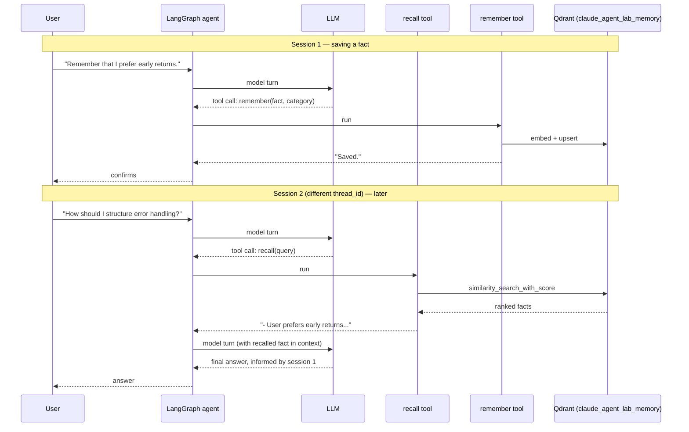

# Progress Log

One entry per session. Each entry stays self-contained enough that a reader with zero context on this project can follow it without opening the diff.

---

## Full backend port from source reference (Phases 1–7)

**Branch:** `dev` (fresh history — see below)
**Date:** 2026-09-07

### In plain terms

Earlier work on this repo (visible in its prior git history, before this branch) tried to rebuild this system from scratch, independently, using only the PRD's phase descriptions as a guide — not by looking at the actual reference codebase. That was a real miscommunication: the intent was always to **port** the reference implementation, phase by phase, adapting and fixing it as needed — not to invent a fresh design that happens to have similarly-named files.

This session corrects that. It copies the entire reference codebase (`source/capstone_project/educosys_claude/`) into this repo in one pass, renames everything per `CLAUDE.md`'s mapping table, and then does the real work: finding and fixing what's actually broken, verified by actually running it — against a live Qdrant database, real MCP servers, a real embedding model — not just checking that the code imports without error.

Because this is a bulk port rather than incremental phase-by-phase construction, this is one consolidated entry covering Phases 1–7 together, rather than seven separate entries re-narrating decisions that were already made by the original author. What follows is what was found, what was fixed, and what was deliberately changed versus left alone — that's the actual engineering content of a port, more so than describing code someone else already designed.

### What changed

- **Every source file copied in and renamed** per `CLAUDE.md`'s mapping: `educosys_claude` → `claude_agent_lab` throughout every import; `educosys_mcp_client.py` → `mcp_client.py`; `educosys_mcp_config.py` → `mcp_config.py`; `get_educosys_mcp_tools()` → `get_agent_mcp_tools()`; `load_educosys_mcp_configs()` → `load_mcp_configs()`; `educosys_mcp_servers.json` → `mcp_servers.json`; `.educosys/` → `.agent_lab/`; the Qdrant collection name; the CLI's own banner text; `pyproject.toml`'s package name and author.
- **`pyproject.toml`** — ported dependency list, with two real fixes (see below): `tree-sitter-languages` swapped for `tree-sitter-language-pack`, `sentence-transformers` added (was missing but required at runtime).
- **`config.yaml`** — `llm.provider`/`model` changed from `openai`/`gpt-5.5` to `anthropic`/`claude-opus-5`; `embeddings.provider` changed from `openai` to `huggingface` (local, no API key) with `dims` corrected from `1536` (OpenAI's dimension) to `384` (the actual dimension of the chosen local model — this one wasn't a preference, the old value was simply wrong for the new model and would have broken the semantic cache's Redis vector schema); the duplicate `vector_store:` key bug fixed (see below); `vector_store.provider`/`rag.mode` set to `qdrant`/`hybrid` to exercise the more complete, actually-hybrid retrieval path.
- **`context/indexers/code_parser.py`** — fixed the byte-offset/character-offset bug (see below); swapped the `tree_sitter_languages` import for `tree_sitter_language_pack`.
- **`.env.example`, `.gitignore`** — written fresh, reflecting the environment variables the ported code actually reads (`grep`'d for, not guessed) and the local data paths `config.yaml` actually uses.
- **`README.md`, `docs/prd.md`** — rewritten to describe the ported system accurately, including prerequisites (Qdrant, Node/`npx`, optionally Redis) the source code has always required.

### Real bugs found and fixed

These were found by actually running the code, not by reading it carefully enough to spot them in advance — worth being honest about that distinction.

**1. `tree-sitter-languages` is unmaintained and doesn't install on current Python**
- *In plain terms:* The exact library version the source pinned for parsing code (`tree-sitter-languages==1.10.2`) simply refuses to install on Python 3.13 — no compatible wheel exists. The install failed before any code even ran.
- *Fix:* Swapped for `tree-sitter-language-pack`, an actively maintained fork with the identical `get_language()`/`get_parser()` function signatures — confirmed as a true drop-in by testing both against the same Python source and comparing output before committing to the swap.

**2. Byte-offset vs. character-offset bug in the code parser — a real, silent correctness bug**
- *In plain terms:* Every chunk of code this system indexes — its name *and* its actual content — was being sliced out of the source file using the wrong kind of position number whenever the file contained certain punctuation, like an em dash or a smart quote, anywhere earlier in the file. The result wasn't a crash; it was silently wrong data going into the search index.
- *Problem:* `tree-sitter` reports a parsed node's position as `start_byte`/`end_byte` — offsets into the file's *UTF-8-encoded bytes*. The code was slicing the Python `str` (which is indexed by *character*, not byte) using those byte offsets directly: `source[node.start_byte:node.end_byte]`. A pure-ASCII file has one byte per character, so this happens to work — but any multi-byte character earlier in the file (an em dash is 3 bytes in UTF-8, one character) throws every subsequent offset out of alignment with the string's real character positions.
- *How it was found:* Running the real indexer against this project's own files (whose docstrings and comments use em dashes constantly, this being written largely by an assistant with that habit) produced obviously-wrong chunk names in the logs — fragments like `'le(filepat'` and `'ndler(FileSystemEvent'` instead of real function/class names. That's what sent the investigation to `_extract_name` and `_walk`.
- *Fix:* Encode the source to bytes once, pass the *bytes* through the recursive walk instead of the *string*, slice the bytes, and decode only the final extracted piece back to a string. Verified against a minimal repro (a comment containing an em dash before a function definition) and then against the real codebase, confirming clean names post-fix.
- *Why this matters more than it might look:* This bug doesn't just mislabel things in a debug log — the *content* field (`source_bytes[...].decode()`) is what actually gets embedded and stored for retrieval. A silently-corrupted chunk is a chunk that can never be found by a correct query, and nothing about the pipeline would have surfaced that as an error. It would have just made search quietly worse in any file with the punctuation this codebase's own comments use throughout.

**3. `config.yaml`'s duplicate `vector_store:` key**
- *In plain terms:* The config file defined the same setting twice. In YAML, when a key repeats, the *last* one silently wins — so whatever the first `vector_store:` block was trying to say was already being ignored before this port even started. Looked like an in-progress migration from Chroma to Qdrant that was never finished or cleaned up.
- *Fix:* Consolidated to one `vector_store:` block.

**4. Missing `sentence-transformers` dependency**
- *In plain terms:* Switching the embeddings provider to `huggingface` (see the provider-defaults decision below) meant a library (`sentence-transformers`) that the source project's `pyproject.toml` never needed to declare, because it never used that provider by default. Running the embedder without it fails with a clear `ModuleNotFoundError` — an easy one to catch, and worth listing here anyway since "which dependency does a config choice actually pull in" is exactly the kind of thing that's easy to get wrong when changing a default.
- *Fix:* Added `sentence-transformers` to `pyproject.toml`.

### Deliberate changes (not bugs — decisions, and why)

**Provider defaults: Anthropic for chat, local HuggingFace for embeddings**
- The source defaults to OpenAI for both. This fork is named `claude_agent_lab` and every other piece of this project assumes Claude — defaulting the actual LLM call to a different provider than the project's own name would be a strange thing to leave unchanged. `llm/factory.py` already had an `anthropic` branch; this is a config value change, not new code.
- Embeddings: Anthropic has no first-party embeddings API (true in the source project too, which is why it never offered an "anthropic" embeddings branch). Defaulting to a local HuggingFace model instead of OpenAI's means running this fork needs exactly one API key (`ANTHROPIC_API_KEY`), not two, for no functional reason. `llm/factory.py` already had a `huggingface` branch too — again, a config default change.

**`rag.mode: hybrid` / `vector_store.provider: qdrant` as the default, not semantic/chroma**
- The source's checked-in `config.yaml` actually defaulted to Chroma + semantic-only (the duplicate-key bug notwithstanding — both copies said `chroma`). But `CLAUDE.md`'s own renaming table already assumes Qdrant (`Qdrant collection educosys_claude → claude_agent_lab`) — meaning the project's own naming decisions were written with Qdrant as the intended target, even though the checked-in default pointed elsewhere. Defaulted to the more complete, more interesting implementation (`context/indexers/hybrid_qdrant.py`, which does real dense+sparse hybrid search via Qdrant's native support) rather than the plainer Chroma path, which still exists and still works if selected via config.

### Verification performed

Not claimed lightly — each of these was actually run, this session, against real infrastructure:

- **Indexing**: `get_indexer()('claude_agent_lab/llm')` against a live local Qdrant (`docker run -p 6333:6333 qdrant/qdrant`) — real HuggingFace embeddings computed, real FastEmbed sparse (BM25-style) vectors computed, chunks actually stored.
- **Retrieval**: querying that index for `"how do we get the embedder"` correctly returned the `get_embedder` function as the top hybrid-search result (score 1.0) — not just "returns something," the *right* something.
- **Agent construction**: `build_agent(checkpointer)` with a `langgraph.checkpoint.memory.InMemorySaver` — compiled successfully to a `CompiledStateGraph`, connected to **real** MCP servers (`npx`-launched GitHub and filesystem servers), loaded 40 real tools from them, and initialized the skills registry (gracefully, with a warning, when no skills directory exists yet).
- **Full CLI boot**: `python -m claude_agent_lab.main` end to end — indexed 99 real chunks from this project's own codebase, correctly detected Redis wasn't running and disabled the semantic cache instead of crashing, started the file watcher, connected MCP servers, started a session, printed the ready banner, accepted `/exit`, and shut down cleanly (including stopping the watcher).
- **Every one of the 32 ported modules** imports cleanly with no errors.

Not yet verified: a real end-to-end `/ask` or `/plan` call against the live Anthropic API (no API key was available in the sandbox this session ran in) — everything up to and including the actual model call was exercised; the model call itself wasn't.

### Open items

- No automated test suite exists yet — the source project didn't have one, and this session prioritized breadth (get the whole thing running, verified manually against real infra) over adding tests for someone else's ported code. Worth adding, not done here.
- A real `/ask`/`/plan` call against a live Anthropic API key hasn't been exercised — everything up to that call has been.
- The `tasks/`, `skills/`, and `cache/` modules were verified to *import* cleanly but not exercised end-to-end the way indexing/retrieval/agent-construction were — lower risk (they're smaller, more isolated, and `cache/` already has its own graceful-degradation path proven by the full-CLI-boot test), but flagged rather than silently assumed equally solid.

### HLD — the ported system, end to end


### LLD — module map (what lives where, and what phase it maps to)

| Directory | Phase | Key files |
|---|---|---|
| `config.py`, `config.yaml` | 1 | Plain YAML config loaded once at import time into a module-level `config` dict |
| `llm/` | 1 | `factory.py`: `get_llm()`/`get_embedder()`, provider-branching on config |
| `observability/` | 1 | `logger.py`: root logger at WARNING (suppresses third-party noise), app loggers at DEBUG |
| `context/indexers/` | 2 | `code_parser.py` (tree-sitter chunking, 15 languages + text fallback), `factory.py` (mode/provider dispatch), `semantic_qdrant.py`/`hybrid_qdrant.py`/`semantic_chroma.py`, `watcher.py` |
| `context/retrievers/` | 2 | Mirrors the indexers: `factory.py` + one `retrieve()` per backend |
| `agent/` | 3 | `factory.py` (`build_agent`, LangChain `create_agent`), `orchestrator.py` (`handle_query`, semantic-cache-aware), `tools.py` (`search_codebase`) |
| `tools/` | 3 | `filesystem_tools.py` (read/write/append/list/exists), `terminal_tools.py` (`run_command`, `run_in_directory`, denylist + timeout) |
| `memory/` | 4 | `session.py` (current-session file), `short_term.py` (LangGraph SQLite checkpointer + summarization middleware) |
| `mcp/` | 5 | `mcp_client.py` (`get_agent_mcp_tools`), `mcp_config.py` (`load_mcp_configs`, `${VAR}` resolution) |
| `tasks/` | 6 | `planner.py`, `executor.py`, `approval.py`, `recovery.py`, `status.py`, `task_store.py`, `orchestrator.py` |
| `cache/` | 7 | `semantic_cache.py`: Redis + `redisvl`, graceful degradation on connection failure |
| `skills/` | 7 | `registry.py`, `skill_tools.py`: skills loaded as agent tools |

### Interview questions

Question-only — meant as prompts to answer out loud or in writing, not a Q&A key.

**The byte-offset bug**
1. Why does `tree_sitter`'s `start_byte`/`end_byte` not match a Python `str`'s character indices in general?
2. Why did this bug only show up on files containing certain characters, and stay invisible on plain-ASCII files?
3. Besides an em dash, name two other common characters that would trigger the same corruption.
4. Why does the fix pass `bytes` through the whole recursive walk instead of encoding at the point of each slice?
5. Why is this bug worse than a crash would have been?
6. How would you write a regression test that catches this specific class of bug in the future?

**Dependency rot / the tree-sitter swap**
7. What does "no compatible wheel" actually mean, mechanically, when a `pip install` fails?
8. Why was it important to verify `tree-sitter-language-pack` produces identical output to `tree-sitter-languages` before committing to the swap, rather than just checking that it imports?
9. What's the risk of pinning a dependency to an exact version (`==1.10.2`) versus a range, in a project like this one?

**Config bugs**
10. In YAML, what actually happens when a mapping key is repeated? Why doesn't it raise an error?
11. How would you catch a duplicate-key config bug automatically, before it ships?
12. Why did the wrong `dims: 1536` value not cause an immediate error, only a downstream one (in the semantic cache's vector schema)?

**Provider defaults**
13. Why does Anthropic have no embeddings offering, and what do teams building on Claude typically do instead?
14. What's the tradeoff between a local embedding model (HuggingFace, runs on your machine) and an API-based one (OpenAI, Voyage) — cost, latency, quality, setup?
15. If you switched `embeddings.provider` after already indexing a codebase, what would break, and why?

**Agent architecture (LangChain/LangGraph)**
16. What does `langchain.agents.create_agent(llm, tools=..., checkpointer=...)` actually build, at a high level?
17. What is a `thread_id` for, in `agent.ainvoke({"messages": [...]}, {"configurable": {"thread_id": ...}})`?
18. Why does `search_codebase` exist as a *tool* the agent can choose to call, rather than the CLI always retrieving context before every question?
19. What's the difference between the checkpointer (`memory/short_term.py`) and the session file (`memory/session.py`) — what does each one actually track?
20. Why does `SummarizationMiddleware` trigger on a token count, not a message count?

**MCP**
21. What does `get_agent_mcp_tools()` actually do when the CLI starts — trace the call from `mcp_config.py` through to tools being available to the agent.
22. Why is `${CWD}` resolved at load time instead of being hardcoded into `mcp_servers.json`?
23. What would happen if the `npx`-launched MCP server process failed to start — does anything in this codebase handle that gracefully?

**Retrieval**
24. What's the actual difference between `rag.mode: semantic` and `rag.mode: hybrid` in this codebase — what gets stored differently in Qdrant?
25. What is `FastEmbedSparse(model_name="Qdrant/bm25")` actually computing, conceptually?
26. Why does `index_codebase` check for an existing non-empty collection before re-indexing, and what real problem does that avoid?
27. What real limitation does chunking at "the first named block found, don't descend further" (`_walk`'s early `return`) have for a large class with many methods?

**Graceful degradation**
28. Why does `build_semantic_cache()` catch a broad `Exception` and return `None` instead of letting a Redis connection failure crash the app?
29. What's the tradeoff of catching exceptions that broadly, versus catching specific ones (`redis.ConnectionError`, say)?
30. Where else in this codebase does a similar "degrade instead of crash" pattern show up?

**The porting process itself**
31. What's the actual difference between "port the source, fix what's broken" and "write an independent implementation guided by the same file names"? Why does that difference matter for what gets learned?
32. Why does verifying against real infrastructure (a live Qdrant, real MCP servers) catch bugs that "the code imports without error" cannot?
33. What's the risk of silently fixing a bug found during a port without documenting it, versus writing it up the way this entry does?
34. Which of this session's four fixes were forced (the code literally wouldn't run without them) versus discretionary (the code would run, just wrongly or suboptimally)?
35. Why does Phase 8 get built independently while Phases 1-7 were ported — what's the actual distinguishing criterion?

---

## Phase 1 enhancement — multi-provider LLM support (Gemini, Groq, Ollama)

**Branch:** `phase-1-multi-llm-provider` (off `dev`)
**Date:** 2026-09-07

### In plain terms

`llm/factory.py::get_llm()` already had the shape for this — a `provider` string in config picks which LangChain chat class to build. The source only used that shape for two providers (`anthropic`, `openai`, the second one really just "everything else falls through to here"). This session adds three more branches to the exact same pattern: Gemini, Groq, and Ollama (a local model server — no API key at all). Switching between any of the five is a one-line `config.yaml` edit, same as it always was for the original two.

This is an enhancement on top of ported code, not new architecture — `CLAUDE.md`'s own process explicitly calls this kind of thing out as encouraged, distinct from inventing a module the source has no equivalent of at all.

### What changed

- **`llm/factory.py`** — `get_llm()` gained three more `if provider == ...` branches (`gemini` → `ChatGoogleGenerativeAI`, `groq` → `ChatGroq`, `ollama` → `ChatOllama`), before the existing `anthropic` branch and the existing openai fallback — same shape, same fallback-to-openai behavior for anything unrecognized.
- **`pyproject.toml`** — added `langchain-google-genai`, `langchain-groq`, `langchain-ollama`.
- **`config.yaml`** — documented the five accepted `llm.provider` values in a comment.
- **`.env.example`** — added `GOOGLE_API_KEY`, `GROQ_API_KEY`, `OLLAMA_BASE_URL` (optional — only needed if Ollama isn't at the default `http://localhost:11434`).
- **`README.md`** — new "Switching LLM providers" section.

### Verified before writing any of it

`ChatGroq`'s constructor field is `model_name`, **not** `model` — every other provider here (`ChatAnthropic`, `ChatOpenAI`, `ChatGoogleGenerativeAI`, `ChatOllama`) uses `model`. Caught by checking each class's actual pydantic `model_fields` before writing the branch, not by assuming the pattern held across all five. Getting this one wrong would have produced a silent `TypeError` (or worse, a class that happily accepted an unused `model` kwarg and then failed with a confusing "no model configured" error at request time) only visible the first time someone actually tried Groq.

Also verified, not assumed:
- Each provider's API-key field (`google_api_key`, `groq_api_key`) has `default_factory=get_secret_from_env`, confirming they auto-read `GOOGLE_API_KEY`/`GROQ_API_KEY` from the environment the same way `ChatAnthropic`/`ChatOpenAI` already do — not guessed from "well, the others work that way."
- All five branches actually construct (`get_llm()` called once per provider, with fake keys, asserting the right class comes back).
- A non-Anthropic provider (`gemini`) works through the *entire* existing pipeline unmodified — `create_agent(get_llm(), tools=[...], ...)` compiles successfully with a Gemini backend. This is the real claim being made ("swap providers by config, nothing else changes") and it was checked end to end, not just at the factory-function level.

### Architecture decision

**Extend the existing provider-branch pattern, rather than introduce a provider-registry abstraction**
- *In plain terms:* Five `if` branches instead of, say, a dict of provider-name → constructor-function that could be extended by adding a dict entry instead of an `if`.
- *Problem:* `get_llm()` needs to pick between five providers now instead of two.
- *Options considered:* keep the `if`/`elif` chain the source already used, just with more branches; refactor into a provider registry (dict-of-factories) that's arguably more "extensible."
- *What was chosen:* keep the `if` chain.
- *Tradeoff:* A registry would scale slightly better past five providers and let a caller register a custom provider without editing this file. Rejected here specifically because of the process this repo follows: the source's own shape is the `if` chain, and refactoring it into a different pattern *while* adding providers would blur "port + fix + enhance" into "port + redesign" — exactly the distinction `CLAUDE.md` draws a line around. Five explicit branches is also just easier to read top-to-bottom for a project whose whole point is understanding every subsystem, not optimizing for a tenth provider that may never get added.

### Interview questions

1. Why does `ChatGroq` use `model_name` while every other provider here uses `model` — and what would go wrong if the Groq branch used `model` by mistake, matching the others?
2. How was it confirmed that `ChatGoogleGenerativeAI` and `ChatGroq` read their API keys from `GOOGLE_API_KEY`/`GROQ_API_KEY` automatically, rather than assumed from the pattern the other two providers follow?
3. Why does the Ollama branch check for an optional `OLLAMA_BASE_URL` env var instead of always passing `base_url` explicitly?
4. What's actually being claimed by "switching providers is a config-only change," and what test would falsify that claim if it were false?
5. Why did the new branches get inserted before the existing `anthropic` branch and openai fallback, rather than after?
6. What would happen today if `llm.provider` were set to `"claude"` instead of `"anthropic"` — is that a config bug a user would hit, and where would it surface?
7. Why was a provider-registry (dict-of-factories) rejected here even though it would scale better to a sixth or seventh provider?
8. What does verifying `create_agent(get_llm(), ...)` compiles with a Gemini backend actually prove that testing `get_llm()` alone doesn't?
9. If Ollama's local server isn't running, at what point does that failure actually surface — at `get_llm()` construction, or later?
10. What's the blast radius of adding a sixth provider (say, Mistral) — which files change, and does anything about this session's design make that easier or harder than it would otherwise be?

---

## Bug fix — blank `QDRANT_API_KEY` silently forces HTTPS against a local Qdrant

**Branch:** `fix-qdrant-https-inference` (off `main`)
**Date:** 2026-09-07

### In plain terms

Running the CLI against a local Qdrant instance (exactly the setup `README.md` tells you to use) failed at startup with `SSL: WRONG_VERSION_NUMBER` — an error that looks like a TLS/certificate problem but isn't. The actual cause: `qdrant-client` decides whether to use HTTPS based on whether an API key was given, and it checks *"is this `None`?"*, not *"is this empty?"*. `.env.example` ships `QDRANT_API_KEY=` — a blank line, which `os.getenv()` reads back as `""`, not `None`. An empty string is enough to make the client assume you meant a real (HTTPS) Qdrant Cloud endpoint, and it tries to speak TLS to a local server that only speaks plain HTTP — hence the confusing SSL error instead of a connection-refused or an auth error.

This wasn't found by reading the code — it was found because a user actually ran the CLI following the README's own instructions and hit it immediately.

### How this was actually diagnosed (not guessed)

1. Reproduced the exact failure in an isolated Python process against the user's real `.env` and `.venv` — confirmed it wasn't specific to their machine setup.
2. Ruled out a leftover shell-exported `QDRANT_URL` (checked `env | grep -i qdrant` and every shell rc file — nothing) and ruled out a dependency-version difference (`httpx`/`httpcore`/`qdrant-client` versions matched a working test environment exactly).
3. **The retest that actually found it:** re-ran the same reproduction that had worked minutes earlier — a fresh Qdrant container, same code — and it now failed *identically*, in a completely separate Python environment that had never touched the user's machine before. That ruled out anything user- or environment-specific and pointed at something environmental to the *test setup itself* (a stale/reused connection or client instance from earlier testing), which led directly to inspecting `QdrantClient`'s actually-computed connection URL rather than continuing to guess at network causes.
4. Printed `client._client.rest_uri` directly and caught it in the act: `https://localhost:6333` — not `http`. From there, isolating `api_key=None` vs. `api_key=""` with otherwise identical calls reproduced the exact flip in one line.

### The fix

`os.getenv("QDRANT_URL") or None` / `os.getenv("QDRANT_API_KEY") or None`, applied at all four places `QdrantClient`/`QdrantVectorStore` are constructed from these two env vars (`context/indexers/semantic_qdrant.py`, `context/indexers/hybrid_qdrant.py`, `context/retrievers/semantic_qdrant.py`, `context/retrievers/hybrid_qdrant.py`) — every one of them had the identical bare-`os.getenv()` pattern, so every one needed the identical fix. Verified by re-running the actual `get_indexer()(repo_path)` call end to end against a real Qdrant instance afterward — 185 chunks indexed successfully, no SSL error.

### Why this is worth a dedicated entry, not just a one-line changelog note

The mechanism here is genuinely non-obvious: `"" or None` is a familiar Python idiom, but knowing *when* you need it requires knowing that a specific third-party library's constructor treats "empty string" and "not provided" as meaningfully different states — and that difference silently changes which network protocol gets used, producing an error message (`SSL: WRONG_VERSION_NUMBER`) that gives no hint about API keys, `None`, or empty strings at all. This is the kind of bug that's expensive to debug from the error message alone and cheap to prevent once you know the shape of it — exactly the kind of thing worth writing down for anyone (including a future instance of whoever's doing this port) who hits a Qdrant SSL error against a local instance again.

### Interview questions

1. Why does `os.getenv("QDRANT_API_KEY")` return `""` instead of `None` when `.env` has a blank `QDRANT_API_KEY=` line, and why does that distinction matter here specifically?
2. What Python idiom fixes this, and why does it work (`"" or None` vs. `"" if "" else None` vs. `"" is not None`)?
3. Why did comparing `rest_uri` across an `api_key=None` call and an `api_key=""` call — with everything else identical — pin down the root cause faster than reasoning about the SSL error itself?
4. Why did ruling out a leftover shell-exported env var matter before looking anywhere else?
5. This fix touches four files with the identical change. Why wasn't a shared helper function introduced instead of four inline fixes?
6. What would the symptom have looked like instead if `QDRANT_URL` (not `QDRANT_API_KEY`) had been the blank one?
7. Why does `curl http://localhost:6333/healthz` succeeding prove the *server* wasn't the problem, even while the Python client was failing?
8. If `.env.example` instead didn't include `QDRANT_API_KEY=` as a line at all (left it out entirely rather than blank), would this bug still exist? Why or why not?
9. What's the general lesson here about library constructors that infer behavior from "was an optional argument given" — where else in this codebase might the same class of bug be hiding?
10. Why does this bug specifically only affect people following the README's own recommended local-Qdrant setup, rather than everyone who runs the CLI?

---

## Bug fix — MCP tools reconnecting (and respawning subprocesses) on every single call

**Branch:** `perf-mcp-persistent-sessions` (off `main`)
**Date:** 2026-09-07

### In plain terms

`/ask` was slow — several seconds per turn — and the logs showed why: `Secure MCP Filesystem Server running on stdio` printing over and over, once per tool call, instead of once at startup. Every time the agent used a filesystem MCP tool, it was spawning a brand-new `npx @modelcontextprotocol/server-filesystem` subprocess from scratch, doing the MCP handshake, running one tool call, then throwing the whole thing away — repeated for every tool call in a turn. `npx` cold starts are slow (package resolution + Node startup), so this dominated the actual LLM latency by a wide margin.

Separately, `langchain-google-genai` was logging two `WARNING` lines per tool per agent step (`Key 'additionalProperties' is not supported in schema, ignoring` / `Key '$schema' is not supported in schema, ignoring`) — harmless (Gemini's function-calling API rejects those two JSON-Schema keys, and the library strips them before sending), but with ~15 tools bound, that's 30 lines of noise on every single step. Silenced alongside the real fix since both surfaced in the same debugging session.

### The actual bug

`mcp/mcp_client.py` called `MultiServerMCPClient.get_tools()` — the library's own docstring says outright: *"A new session will be created for each tool call."* That's fine for an HTTP-based MCP server (a new connection is cheap), but for a `stdio` transport server, "new session" means "new subprocess." `build_agent()` is only called once at startup, so this wasn't obvious from reading the code — the respawn-per-call behavior is internal to how `langchain-mcp-adapters` wraps the tools it returns, not something visible in this codebase's own call sites.

### How this was actually found

Diagnosed from the log pattern itself, not by reading `langchain-mcp-adapters`' source first: the repeating `Secure MCP Filesystem Server running on stdio` block, appearing every few seconds during a single `/ask` call rather than once at process startup, was the concrete signal that something was reconnecting mid-turn. That led directly to `MultiServerMCPClient.get_tools()`'s docstring, which states the per-call-session behavior explicitly — confirmed by inspecting the installed `langchain-mcp-adapters==0.3.2` source directly (`inspect.getsource`) rather than assuming behavior from the API surface.

### The fix

Open one session per configured MCP server via `client.session(server_name)`, kept alive for the life of the app by registering it on an `AsyncExitStack` the caller (`main.py`'s REPL loop, `api/app.py`'s FastAPI `lifespan`) already holds open across its own runtime — the exact same lifetime the LangGraph `AsyncSqliteSaver` checkpointer already uses. `build_agent()` now takes that `exit_stack` as a parameter instead of managing MCP connections internally.

```python
async def get_agent_mcp_tools(exit_stack: AsyncExitStack) -> list:
    configs = load_mcp_configs()
    client = MultiServerMCPClient(configs)
    tools = []
    for server_name in configs:
        session = await exit_stack.enter_async_context(client.session(server_name))
        tools.extend(await load_mcp_tools(session))
    return tools
```

### Verified before and after

Called the same filesystem MCP tool three times in a row in an isolated script: **before** the fix, `Secure MCP Filesystem Server running on stdio` printed on every call; **after**, it printed exactly once, at connection time, with all three tool calls succeeding against the same live session.

### Architecture decision

**Thread an `AsyncExitStack` through `build_agent()`, rather than have `mcp_client.py` manage its own global session lifecycle**
- *Problem:* MCP sessions need to live exactly as long as the app process (or the FastAPI app), and be cleanly closed on shutdown — the same lifetime constraint `AsyncSqliteSaver.from_conn_string(...)` already has, which is why it's used via `async with` in both `main.py` and `api/app.py`.
- *Options considered:* (a) a module-level global client/session in `mcp_client.py`, opened lazily and never explicitly closed; (b) pass an `AsyncExitStack` down from the same `async with` block that already owns the checkpointer's lifetime.
- *What was chosen:* (b).
- *Tradeoff:* A module-level global would need less code at each call site, but ties MCP session cleanup to interpreter exit rather than to an explicit `async with` scope — fine for a long-running singleton process, but wrong for the FastAPI app, where `lifespan()`'s whole point is well-defined startup/shutdown. Reusing the exit stack the caller already holds open for the checkpointer keeps both resources' lifetimes explicit and symmetric, at the cost of one extra parameter threaded through `build_agent()` and `get_agent_mcp_tools()`.

### Interview questions

1. Why does `MultiServerMCPClient.get_tools()` open a new session per tool call instead of per app run — what would `langchain-mcp-adapters` have to assume about server state to do otherwise safely?
2. For an HTTP-transport MCP server instead of `stdio`, would this bug still cause a meaningful slowdown? Why or why not?
3. What was the actual log-level signal that pointed at MCP reconnection rather than, say, slow LLM calls or slow embedding?
4. Why register the MCP session on the *caller's* `AsyncExitStack` rather than have `get_agent_mcp_tools()` open and manage its own?
5. What happens to an open MCP session if the process crashes without going through `AsyncExitStack.__aexit__`? Does anything leak?
6. Why does `main.py`'s `AsyncExitStack` sit in the same `async with (...)` statement as `AsyncSqliteSaver.from_conn_string(...)` rather than a separate nested block?
7. If a second MCP server were added to `mcp_servers.json`, does anything about this fix need to change, or does it scale automatically?
8. Why was `inspect.getsource()` used to read `langchain-mcp-adapters`' actual installed source rather than trusting its public documentation or type hints?
9. What's the tradeoff of silencing `langchain_google_genai._function_utils` warnings at the logger level versus fixing the tool schemas themselves so `additionalProperties`/`$schema` are never generated in the first place?
10. Could this same per-call-reconnection bug exist anywhere else in this codebase that also wraps a "stateless" client API without realizing it opens a new connection per call?

---

## New capability — long-term memory (cross-session facts/preferences)

**Branch:** `feat-long-term-memory` (off `perf-mcp-persistent-sessions`)
**Date:** 2026-09-07

### In plain terms

Everything this agent remembers about a conversation lives in `memory/short_term.py` — a LangGraph checkpointer keyed by `thread_id`, wiped clean (functionally, if not literally deleted) the moment you start a new session with `/new_session`. There was no way for the agent to carry a fact — "the user prefers early returns over nested if/else," "this project uses Poetry, not pip" — forward into a *different* session. `memory/session.py` and `short_term.py` are both direct ports of the source's own `memory/` module; the source has no third file for this. This is genuinely new work, not a port, per `CLAUDE.md`'s own rule about what's fair game for independent design when the source has no equivalent.

### What changed

- **`memory/long_term.py` (new)** — `remember(fact, category)` writes a fact into a Qdrant collection (`claude_agent_lab_memory` by default, separate from the code-index collection); `recall(query, k)` does a semantic similarity search over it. Same embedder (`llm/factory.py`'s `get_embedder()`) as the code index, so switching `embeddings.provider` affects both.
- **`agent/tools.py`** — `remember`/`recall` wrapped as LangChain tools, same shape as the existing `search_codebase` tool.
- **`agent/factory.py`** — both tools registered on the agent; system prompt extended to tell the model when to use each (`recall` before answering if a past preference might apply, `remember` only for durable facts — not one-off details).
- **`config.yaml`** — new `long_term_memory.collection_name` setting.

### Architecture decisions

**Storage: a separate Qdrant collection, not a new database**
- *Problem:* Facts need to be found by meaning ("how should I handle errors?" should match a stored fact about preferring early returns), not exact string match — a plain SQLite `LIKE` table wouldn't do that.
- *Options considered:* (a) a new Qdrant collection, reusing infrastructure the code index already exercises; (b) a new table in the existing SQLite checkpointer DB with a separate embedding index bolted on; (c) a third database entirely (e.g. a dedicated vector DB just for this).
- *What was chosen:* (a).
- *Tradeoff:* Reuses `QdrantClient`/`QdrantVectorStore` code paths this project already depends on and has already debugged (see the `QDRANT_API_KEY=""` HTTPS bug — the same `or None` fix applies here), at the cost of two Qdrant collections to keep straight instead of one. Rejected (b) because SQLite has no native vector search, and rejected (c) because introducing an entirely separate storage system for one small feature would be a heavier footprint than the feature justifies.

**Retrieval: explicit agent-called tools, not automatic injection into every prompt**
- *Problem:* Stored facts need to reach the model's context somehow — either automatically prepended to every request, or fetched only when the model decides to.
- *Options considered:* (a) two tools (`recall`/`remember`) the agent calls explicitly, mirroring `search_codebase`'s existing pattern; (b) always run a `recall(question)` search before every agent turn and inject the top-k results into the system prompt automatically, with no tool call involved.
- *What was chosen:* (a).
- *Tradeoff:* (b) guarantees relevant facts are never missed by the model simply not calling a tool, but costs an embedding + Qdrant round-trip on *every single turn*, even ones with no relevant long-term facts at all, and makes "why did the model bring up X" harder to trace (it's not a visible tool call in the log, just silently-injected context). (a) costs nothing when the model judges recall irrelevant, keeps every memory read/write visible as a named tool call in the same trace the rest of this project already relies on for debugging, and matches the existing tool-driven design (filesystem, terminal, skills, codebase search — everything already goes through an explicit tool, not implicit context injection). Tradeoff accepted: relies on the model actually deciding to call `recall`, which the system prompt nudges but doesn't force.

### LLD — what's new

| File | Symbol | Responsibility |
|---|---|---|
| `memory/long_term.py` | `remember(fact, category)` | Embed + upsert one fact into the LTM Qdrant collection |
| `memory/long_term.py` | `recall(query, k)` | Semantic search over stored facts |
| `memory/long_term.py` | `_store()` | Lazily creates the LTM collection (dims from `config.yaml`'s `embeddings.dims`) on first use |
| `agent/tools.py` | `remember` / `recall` (`@tool`-wrapped) | Agent-callable wrappers, logged like every other tool call |
| `agent/factory.py` | `build_agent()` | Registers both tools; system prompt updated |

### HLD — how a fact gets saved and later recalled



### Verified before writing docs

Ran `remember`/`recall` directly against a live Qdrant instance (not mocked): saved two facts ("user prefers early returns over nested if/else," "this project uses Poetry, not pip"), then queried with two different questions. The style-preference fact ranked first for an error-handling query (score 0.30 vs 0.08); the Poetry fact ranked first for a package-installation query (score 0.15 vs -0.20) — confirming real semantic ranking, not just successful writes. Confirmed via `curl localhost:6333/collections` that `claude_agent_lab_memory` exists as a collection distinct from the code index (`claude_agent_lab`).

### Open items

- No automatic promotion from short-term to long-term memory — the model has to decide to call `remember`; nothing scans a session's history afterward and extracts facts automatically. That's a deliberate scope cut (see Architecture Decisions above), not an oversight, but worth knowing if facts seem to go unsaved: it means the model judged them not worth remembering, or wasn't asked to.
- No de-duplication or forgetting mechanism — `remember` always inserts a new point; saving a contradicting preference twice leaves both in the collection and `recall` may surface either depending on ranking. No expiry (unlike the semantic cache's `ttl`).
- `category` is a free-text string the model chooses, not a fixed enum — consistent (`"style"`, `"convention"`) in testing so far, but nothing enforces it.

### Interview questions

1. Why does this feature use a second Qdrant collection instead of a second collection *type* (e.g. a payload filter on the existing code-index collection)?
2. What's the actual risk of `remember` having no de-duplication — walk through what `recall` returns if the user states the same preference twice, worded differently?
3. Why was automatic fact-recall on every turn rejected in favor of an explicit `recall` tool call — what's the concrete cost difference?
4. What happens if the LLM never calls `recall` even though a relevant fact exists — is that a silent failure, and how would you notice it happened?
5. Why does `_store()` recreate a `QdrantClient` connection on every call to `remember`/`recall` instead of caching one? Is that consistent with the rest of this codebase's Qdrant usage?
6. What would break if `long_term_memory.collection_name` in `config.yaml` were accidentally set to the same value as `qdrant.collection_name`?
7. Why does `remember`'s docstring explicitly tell the model *not* to use it for one-off details — what would happen to the collection over many sessions if it did?
8. How does this feature's embedding dependency (`config['embeddings']['dims']`) create a coupling between `long_term_memory` and the code-index config — what happens if you switch `embeddings.provider` after facts are already stored?
9. Why is this considered "new design" rather than a port, when `memory/session.py` and `memory/short_term.py` in the same directory *are* ports?
10. What's the actual difference between what `search_codebase` retrieves and what `recall` retrieves — could they share a retriever abstraction, and why don't they here?
11. If two different users ran this CLI against the same Qdrant instance, what would go wrong with long-term memory specifically (see `docs/prd.md`'s single-user assumption)?
12. Why does `recall`'s tool description say "searches across every past session" — what data structure actually makes that true, given `thread_id` scoping doesn't apply here at all?
13. What would a "forgetting" mechanism need to look like for this store, and why doesn't one exist yet?
14. Walk through exactly what happens in Qdrant if `remember` is called before the `claude_agent_lab_memory` collection exists — which function creates it, and with what vector configuration?
15. Why does `category` default to `"general"` instead of being a required parameter?
